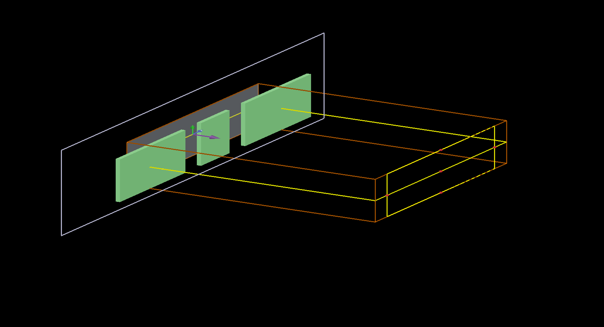
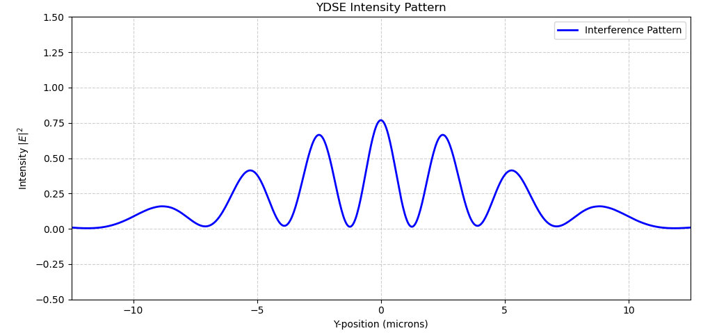

# 🌊 Young's Double Slit Experiment (YDSE)

Welcome! This repository explores the fundamental principles of wave optics and interference through the classic Young's Double Slit Experiment. It includes theoretical foundations, visual guides, and a complete Finite Difference Time Domain (FDTD) simulation setup using Ansys Lumerical.

## 📖 What is YDSE?
First performed by Thomas Young in 1801, this experiment demonstrates the wave nature of light. When a coherent light source passes through two closely spaced parallel slits, the waves emerging from the slits overlap and interfere with each other. 

This interference creates a distinct pattern of alternating bright (constructive interference) and dark (destructive interference) fringes on a viewing screen placed behind the slits.

### 📐 Core Governing Equations
The geometry of the interference pattern is predicted by two primary formulas:

* **Fringe Width (β):** The distance between two consecutive bright or dark fringes.
  > **β = (λ * D) / d**
* **Fringe Position (Yₙ):** The exact distance of the *nth* bright fringe from the central maximum.
  > **Yₙ = (n * λ * D) / d**

*(Where **λ** = Wavelength, **D** = Distance to screen, **d** = Slit separation, and **n** = Fringe order).*

---


---

## 🖥️ Lumerical FDTD Simulation
To visualize the electromagnetic wave propagation in real-time, this project utilizes a 2D FDTD simulation. The screen is modeled using a Perfect Electrical Conductor (PEC) to ensure a perfectly opaque barrier, and a Continuous Wave (CW) plane source is injected to generate a sustained, bright interference pattern.
## 🏗️ 3D Simulation Setup in Lumerical FDTD
This layout view shows the physical construction of the experiment within the Lumerical CAD environment. The green blocks represent the Perfect Electrical Conductor (PEC) barrier forming the two slits, while the orange wireframe defines the FDTD simulation boundaries.



## 📈 Extracted 1D Intensity Profile
This plot represents the cross-sectional intensity ($|E|^2$) extracted from the far edge of the simulation. It clearly demonstrates the sharp interference fringes modulated by the broader single-slit diffraction envelope.



## 🌊 FDTD Simulation: Visualizing Wave Interference
<video src="./ydse1_ydse_movie.mp4" width="1000" controls autoplay loop></video>


https://github.com/user-attachments/assets/79b41b7c-7041-4ae0-8a79-a5dd5d4ad57a


You can build the entire setup instantly by running the following script in the Lumerical Script Prompt:
### Simulation Script (LSF)
```lumerical
# ==========================================
# YDSE Continuous Wave Simulation Setup
# ==========================================

clear; newproject;

# 1. Define Parameters
wl = 0.5e-6;             # Wavelength (500 nm)
slit_width = 0.5e-6;     # Width of each slit
slit_distance = 3e-6;    # Distance between slit centers
screen_thickness = 0.1e-6; 
sim_span_x = 12e-6;      
sim_span_y = 15e-6;      

# 2. Add FDTD Region
addfdtd;
set("dimension", "2D");
set("x", 0); set("x span", sim_span_x);
set("y", 0); set("y span", sim_span_y);
set("mesh accuracy", 2);
set("simulation time", 2000e-15); # Extended time for steady CW pattern

# 3. Build PEC Screen Blocks
addrect; set("name", "middle_block"); set("x", -sim_span_x/4); set("y", 0); set("x span", screen_thickness); set("y span", slit_distance - slit_width); set("material", "PEC (Perfect Electrical Conductor)");
addrect; set("name", "top_block"); set("x", -sim_span_x/4); set("y", sim_span_y/2); set("x span", screen_thickness); set("y span", sim_span_y - (slit_distance + slit_width)); set("material", "PEC (Perfect Electrical Conductor)");
addrect; set("name", "bottom_block"); set("x", -sim_span_x/4); set("y", -sim_span_y/2); set("x span", screen_thickness); set("y span", sim_span_y - (slit_distance + slit_width)); set("material", "PEC (Perfect Electrical Conductor)");

# 4. Add Continuous Wave (CW) Source
addplane;
set("injection axis", "x-axis"); set("direction", "Forward");
set("x", -sim_span_x/4 - 1e-6); set("y", 0); set("y span", sim_span_y);
set("center wavelength", wl);
set("pulse type", "Continuous"); # Set to CW for bright, sustained pattern

# 5. Add Monitors
addprofile; set("name", "interference_profile"); set("x", sim_span_x/8); set("x span", 3*sim_span_x/4); set("y", 0); set("y span", sim_span_y);

addmovie; set("name", "ydse_movie"); set("x", sim_span_x/8); set("x span", 3*sim_span_x/4); set("y", 0); set("y span", sim_span_y);
set("scale", 5); # Boost visual intensity

zoomextent;
